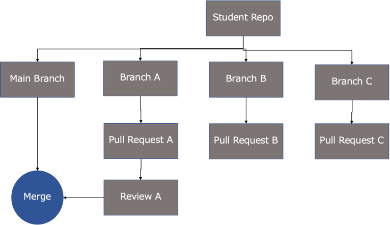
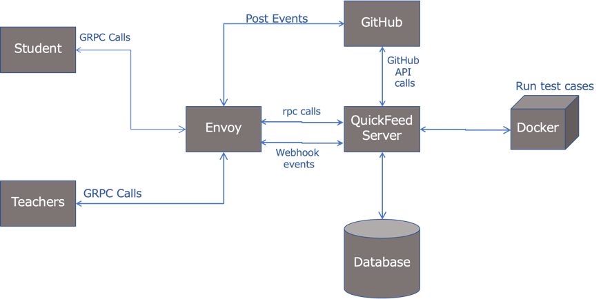

# Quickfeed Support for Feedback via Pull Requests and Issues

## Existing Solution 

In the current implementation of QF, each organization (subject) has one main repository for each course maintained by the Teacher and Teacher Assistant.
Each Student has a Separate replica of the main course repository on which they work. QF only take code from the main branch of the student to runs test and show results.

## Required Enhancement

The main goal of this enhancement is to add support for the students so that they can directly create pull requests for their assignments related to the corresponding issues on Github created by QuickFeed.
Also, students can review each other's pull requests and can add their reviews on other students' pull requests. After the review of PR from students and Teachers, they can merge their PR into the main branch.
As more details are mention in  this issue [this issue #416](https://github.com/autograde/quickfeed/issues/416)

####Below are the enhancement's that will be implemented.

1. Creation of student repositories.
2. Creation of GitHub issues for the Assignment.
3. Running test cases on student branch.
4. Selecting Pull Request by QF.
5. Adding Reviews to PR
6. Merging PR

## Proposed Solution

#### Creation of student repositories.

1. For each course, teacher and teacher assistant will maintain one Main Repository. Each student will also have to create a student repository for them to work on the assignment. 

#### Creation of GitHub issues for the Assignment.

1. Each assignment will consist of multiple tasks, and for each task Quick Feed will create an issue on a student GitHub Repository. The students should create a PR for every issue created on their repository.

   
##### Challenges:
If there are several tasks in an assignment, it will create individual issues for each task. All students will create pull request for each issue which will lead to creation of multiple pull requests which has to be reviewed by the teacher/ teacher assistant.

Scenario: If an assignment has 4 tasks, and there are 10 students. There will be 40 pull requests to be reviewed.

2. Another approach, Quick Feed will create only one issue on student repository for all the tasks in an assignment. Therefore, student must create only one pull request per assignment.

##### Challenges:

If there are multiple tasks, the pull request will be long as it contains the solution for all the tasks and is also difficult for the reviewer to review the code.
Also, it will be difficult to differentiate the implementation of each task in the pull request.

3. Also, we can use both approaches depending on course but teachers have to specify in each course.

#### Running test cases on student branch

1. When a student “push” a new branch to their repository, the Quick Feed will pull the branch and run the test cases. It will also show the result of the test cases on the branch.

#### Selecting Pull Request

1.	 To close an issue, the student should create a PR. After the deadline, the Quick Feed should select the pull request which has to be evaluated.

##### Challenges:

If a student creates multiple PR on their repository, it is not possible for the QuickFeed to know which is the final PR of the student.

##### Solution:

•	We must specify a naming convention for the final branch the student wants to do a PR (ex: studentname_assignment1).
•	The student must add a specific commit message (ex: final submission) to the PR that must be considered.
•	We can also make it mandatory for the students to add the link of the issue in the PR.

#### Reviews on PR

1. After the deadline and maximum slip days of the assignment, Quick Feed will automatically and randomly add reviewers for each PR. The number of reviewers to be added will depend on the specified policy of the course.
2. One reviewer should always be a Teacher/ TA.

The reviewer should have passed the test cases in order to be eligible to review a PR.

A student who is not able to pass the test case will not be allowed to review any PR. But his PR will be reviewed.

We need to make sure that the student is not assigned as a reviewer for his own PR.

####Challenges:

If only few students have passed the test cases, they will end up reviewing PRs for a large number of students.

Scenario: If only 2 students have passed out of 20 students. Each of the 2 students should review 10 student’s PR.

#### Merging PR
1. We can set some branch rules for merging pull request like required number of reviewers etc

2. We will only add student as a collaborator in their Repositories.
3. 
4. If the PR has been reviewed and approved by all the reviewers assigned, either the student or the TA will be able to merge the PR into the main branch.

5. The PR should be approved only if all the test cases are passed.

6. Once the PR is merged, the issue will be closed.

## Architecture

Existing architecture of QuickFeed

